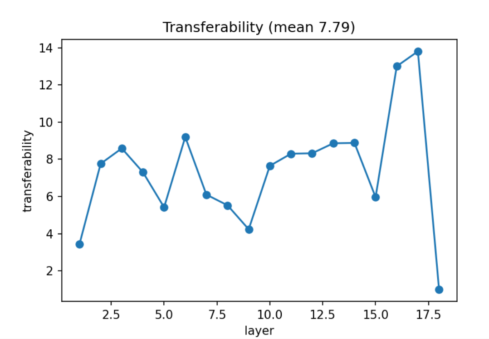

# Measuring the Transferability of Pre-trained DNNs

This is the repository of the paper "Rethinking Two Consensuses of Transferability of Pre-trained Deep Neural Networks", under review in AAAI2024.
In this repo, we implement the PyTorch codes and examples for measuring pre-trained DNNs' transferability on downstream tasks.

## 1. Brief Introduction to this Method

As learned knowledge, the pre-trained parameters of DNNs act as a closer initialization to the optimal point for the downstream tasks than random initialization. Based on this point of view, we quantify transferability as the extent to which pre-training helps to push the parameters closer to the optimal point for the downstream task. More transferable parameters should be closer to the optimal point of the downstream task, making the adaptation to the target domain easier. This method allows us to compare the transferabilities between different downstream tasks under the same standard, and to derive the transferabilities of different layers with precision.

Specifically, we first calculate the parameter distance $D(\theta_r, \theta_B)$ and $D(\theta_A, \theta_B)$, where $\theta_r$ is the random initialization, $\theta_A$ and $\theta_B$ are the convergence points on pre-training task $A$ and downstream task $B$. The transferability of pre-trained $\theta_A$ on task $B$ to reach $\theta_{FB}$ is $T_{FB}(\theta_A) = D(\theta_r, \theta_{FB})/D(\theta_A, \theta_{FB})$ (left in the following figure). To avoid the parameter scale problem in different layers, we calculate the transferability for all layers and regard the mean value as the transferability of the whole DNN (right in the following figure).


## 2. Step-by-Step Implementation

(1) Pre-train a DNN (*e.g.*, resnet) on a large dataset (*e.g.*, ImageNet), and save the initialization parameters and converged parameters as random_init_model.pth and ImageNet_model.pth, respectively. For your convenience, these model parameters can be found in the folder "ckpt".

```
python pretrain_on_ImageNet.py --seed 0 --data_dir <your ImageNet directory> --max_epoch 120\
                               --batch_size 256 --lr 0.1 --weight_decay 1e-4\
                               -r random_init_model.pth -a ImageNet_model.pth
```

(2) Fine-tune the pre-trained DNN on a downstream task (*e.g.*, CIFAR-10), and save the converged parameters (*e.g.*, cifar10_model_lr001.pth).

```
python finetune.py --dataset CIFAR-10 --data_dir <your data directory>\
                   -a ImageNet_model.pth -b cifar10_model_lr001.pth --max_epoch 100\
                   --batch_size 18 --lr 0.01 --weight_decay 1e-4
```

(3) Calculate the layer-wise and overall transferability of the DNN. You can also find the three checkpoints in the folder "ckpt" for fast reproducing.

```
python cal_transferability.py -r random_init_model.pth\
                              -a ImageNet_model.pth\
                              -b cifar10_model_lr001.pth
```

Output: 

Layer-wise transferability:  [3.44, 7.76, 8.59, 7.3, 5.42, 9.2, 6.1, 5.52, 4.23, 7.65, 8.3, 8.32, 8.86, 8.88, 5.96, 13.0, 13.81, 1.0]




## 3. Finding: domain gap only has a smaller effect on transferability than the downstream intraclass variance and data amount

Dataset | Domain gap $\mathcal{G}$ | Intraclass variance $\mathcal{D}$ | Data amount $\mathcal{N}$ | Transferability $T_{FB}(\theta_A)$
---  |:---------:|:---------:|:---------:|:---------:
CIFAR-10 | 2.27 | 0.665 | 50,000 | 7.79 |
CIFAR-100 | 2.39 | 0.075 | 50,000 | 5.59 |
Caltech-101 | 0.63 | 0.087 | 3,060 | 23.92 |
CUB-200 | 1.62 | 0.042 | 5,994 | 21.96 |
Aircraft | 2.95 | 0.064 | 6,667 | 12.45 |
Flowers | 1.64 | 0.449 | 1,088 | 106.30 |
Land Use | 1.89 | 0.364 | 1,680 | 39.09 |
POCUS | 13.12 | 1.200 | 1,692 | 53.58 |
DTD | 0.74 | 0.213 | 1,880 | 24.15 |
DomainNet-r | 0.027 | 467.7 | 120,906 | 6.32 |
DomainNet-p | 0.027 | 455.5 | 50,416 | 7.12 |
DomainNet-c | 0.027 | 823.2 | 33,525 | 8.91 |
           
Multiple regression gives the following relationship, showing that the domain gap has only a weak correlation with transferability, while the data diversity and amount of the downstream task have more significant effects:

ResNet50: 
$log(\hat{T}_{FB}(\theta_A)) =-0.26 \mathcal{G} + 0.32 \mathcal{D} - 0.61 log(\mathcal{N}) + 2.86$

ResNet34: 
$log(\hat{T}_{FB}(\theta_A)) =-0.15 \mathcal{G} + 0.25 \mathcal{D} - 0.64 log(\mathcal{N}) + 2.31$

DenseNet121: 
$log(\hat{T}_{FB}(\theta_A)) =-0.14 \mathcal{G} + 0.28 \mathcal{D} - 0.71 log(\mathcal{N}) + 2.76$

ViT small: 
$log(\hat{T}_{FB}(\theta_A)) =-0.01 \mathcal{G} + 0.08 \mathcal{D} - 0.85 log(\mathcal{N}) + 2.76$


## 4. Finding: most of the layer-wise transferabilities are not decreasing

For ResNet50:


For DenseNet121 and ViT small:


## 5. Environment
The code is developed with an Intel(R) Xeon(R) Silver 4210R CPU @ 2.40GHz and a single Nvidia Ampere A100 GPU.

The install script *requirements.txt* has been tested on an Ubuntu 18.04 system.

:cloud::cloud::cloud::cloud::cloud::cloud::cloud::cloud::cloud::cloud::cloud::cloud::cloud::cloud::cloud::cloud::cloud::cloud::cloud::cloud::cloud::cloud::cloud::cloud::cloud::cloud::cloud::cloud::cloud::cloud::cloud::cloud::cloud::cloud::cloud::cloud:

## 6. License

Licensed under an MIT license.


